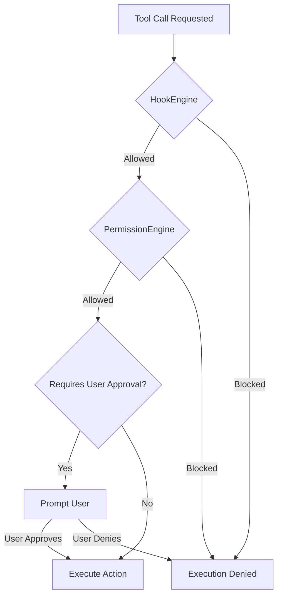
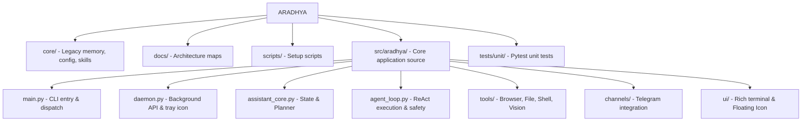

<div align="center">
  <h1>✨ Aradhya</h1>
  <p><strong>A Local-First Operating Intelligence (OI) Assistant for Windows</strong></p>

  [](https://www.python.org/downloads/)
  [](https://www.microsoft.com/en-us/windows/)
  [](https://ollama.com/)
</div>

<br />

> **Aradhya** is a comprehensive **Windows Operating Intelligence (OI) layer**—featuring intent routing, local context, model orchestration, dynamic skills, browser automation, visual awareness, and safe tool execution. It represents a paradigm shift from a generic chatbot wrapper to an integrated system orchestrator.

---

## 🚀 Key Features

* **🧠 Local-First Inference**: Prefers Ollama for local model execution, keeping your data private, with optional fallback to cloud models via OpenRouter.
* **🛡️ Sovereign Safety**: Routes all device-affecting actions through a strict, multi-layered Confirmation Gate (Hooks → Permissions → User Approval). "Dry-run" is the default behavior.
* **💻 Multi-Modal Interfaces**: 
  * **Rich Terminal UI**: Interactive CLI with slash commands and dynamic `<thought>` block rendering.
  * **Desktop Floating Icon**: System overlay for quick toggles (Mic, Screen Watch, Debate AI) via rapid IPC.
  * **Telegram Bot**: Secure remote access simulating a live-streaming experience.
* **🛠️ Extensive Tool Registry**: Built-in tools for file management, shell execution, web browsing, **browser automation**, **vision (screen capture and reading)**, power management, scheduling, and persistent sessions.
* **📜 Robust Audit & State**: Every action is logged in JSONL format, and session/context memory is managed robustly via a thread-safe **SQLite State Store** with automatic compaction.
* **🎙️ Voice Integration**: Supports voice inbox processing, optional local transcription, push-to-talk hotkeys, and continuous background wake-word activation.
* **🔌 Parasite OS Subsystems**: Dynamically load skills (`SKILL.md`), customized agents, hooks (`HookEngine`), and permissions (`PermissionEngine`).
* **🌐 Local API Catalog & Topology**: Browse a local public API catalog and discover network topology for LAN federation.

---

## 📋 Requirements

Before you begin, ensure you have the following installed:
- **Windows 10 or 11**
- **Python 3.10+**
- **Git**
- **[Ollama](https://ollama.com/)** (with at least one local model downloaded)

---

## 🛠️ Quick Start

### 1. Installation

Open PowerShell and clone the repository:

```powershell
git clone https://github.com/Saurabh0003M/ARADHYA.git ARADHYA
cd ARADHYA
scripts\first_run.bat
```

### 2. Verify Environment

Ensure everything is configured correctly:
```powershell
scripts\doctor.bat
```

### 3. Launch Aradhya

Start the assistant CLI:
```powershell
.\arise.bat
```

Or, launch the background daemon (with the system tray and floating icon):
```powershell
venv\Scripts\python.exe -m src.aradhya.daemon
```

---

## 💬 Command Reference

### Core Commands
| Command | Description |
|---|---|
| `/help` | Display all available commands |
| `/status` | Show model, voice, skills, wake state, and live execution state |
| `/topology` | Show local topology (use `/topology rescan` to regenerate) |
| `/sleep` | Send Aradhya to idle mode |
| `exit` | Shut down the CLI |

### Tools & Integration
| Command | Description |
|---|---|
| `/icon on/off` | Control the floating quick-access icon |
| `/telegram start/stop` | Control the Telegram channel (if configured) |
| `/daemon start/stop` | Manage the background Daemon and local API |
| `/cache` | Validate and benchmark the local context cache |
| `/apis search <query>` | Use the local public API catalog |
| `/parasite status` | Operate Parasite OS host-repo digestion |
| `/audit` | Show recent audit log entries |

### Voice Commands
| Command | Description |
|---|---|
| `/voice process` | Process pending audio from `audio/inbox` |
| `/voice activate` | Start live microphone capture |
| `/wake-word on/off` | Toggle background wake-word detection ("wakeup", "arise") |

---

## 🔒 Safety First

Aradhya is designed around **User Sovereignty**:



- **Confirmation Gates**: Risky tools (shell execution, writes, browser clicks) require your explicit approval (`yes proceed`).
- **Hook & Permission Engines**: System actions are evaluated through dynamic rules and project-level hooks before they ever prompt the user.
- **Dry-Run Default**: `allow_live_execution` is disabled by default.
- **Cloud Privacy Gate**: Optional cloud model workers (via OpenRouter) are gated behind an automatic privacy assessment to prevent sensitive data leaks.

---

## ⚙️ Configuration

Aradhya uses a flexible configuration hierarchy. The active model config is loaded from:
1. `core/config/profile.local.json` *(Primary)*
2. `core/config/profile.json`

**Key Configuration Fields:**
- `model.provider`: `ollama` (default) or `openrouter`.
- `model.model_name`: Your selected model (e.g., `gemma4:e4b` or `deepseek/deepseek-v4-flash:free`).
- `allow_live_execution`: Toggle live execution vs dry-runs.
- `user_roots`: Define specific search roots instead of scanning the entire home folder.

---

## 🎙️ Voice & Audio Setup

**Default Voice Provider**: `manual_transcript` (Zero setup)
1. Drop audio in `audio/inbox` and text in `audio/manual_transcripts`.
2. Run `/voice process`.

**Optional Local Transcription (Whisper):**
```powershell
venv\Scripts\python.exe -m pip install -r requirements-voice.txt
```

**Optional Live Microphone Activation:**
```powershell
venv\Scripts\python.exe -m pip install -r requirements-voice-activation.txt
```

---

## 🧩 Advanced Subsystems (Parasite OS)

- **Skills Framework**: Bundled in `core/skills/` (e.g., Dev Assistant, Sprint Factory, Screen Reader). Managed via `/skills`.
- **Hooks & Permissions**: Defined in `hooks.json` and `permissions.json`. Enables deep lifecycle interventions (`PreToolUse`, `SessionStart`).
- **Agents**: Custom YAML-frontmatter agent routines managed in `~/.aradhya/agents`.
- **Session Management**: Automatically compacts large context histories into summaries and persists state in a robust **SQLite WAL database** (`state.sqlite`).

---

## 🏗️ Project Architecture



```text
📦 ARADHYA
 ┣ 📂 core/          # Legacy memory, configuration, bundled skills
 ┣ 📂 docs/          # Architecture maps and visions
 ┣ 📂 scripts/       # Setup scripts
 ┣ 📂 src/aradhya/   # Core application source
 ┃ ┣ 📜 main.py               # CLI entry & dispatch
 ┃ ┣ 📜 daemon.py             # Persistent background API & tray icon
 ┃ ┣ 📜 assistant_core.py     # State, Planner, Session aggregation
 ┃ ┣ 📜 agent_loop.py         # ReAct execution & safety gates
 ┃ ┣ 📂 tools/                # Capabilities: Browser, File, Shell, Vision
 ┃ ┣ 📂 channels/             # Telegram bot integration
 ┃ ┗ 📂 ui/                   # Rich terminal & Tkinter Floating Icon
 ┗ 📂 tests/unit/    # Pytest unit tests
```

---

## 👨‍💻 Development

Run unit tests:
```powershell
venv\Scripts\python.exe -m pytest tests\unit
```

Use a dedicated base temp directory outside the Git worktree when validating cleanup-sensitive changes:
```powershell
venv\Scripts\python.exe -m pytest tests\unit --basetemp C:\tmp\aradhya_readme_cleanup
```

Run the environment doctor to diagnose issues:
```powershell
scripts\doctor.bat
```
