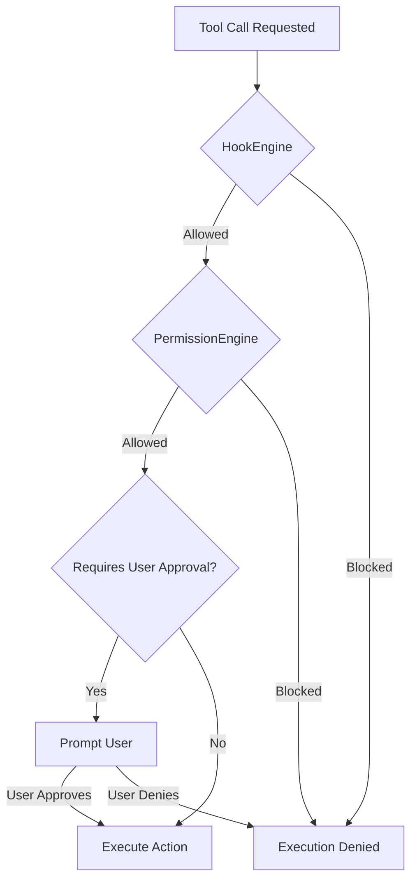
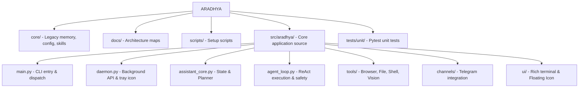

<div align="center">
  <h1>✨ Aradhya</h1>
  <p><strong>A 100 % On-Device Operating Intelligence for Windows — powered by Ollama, privacy-first, offline-capable</strong></p>

  [](https://github.com/Saurabh0003M/ARADHYA/actions/workflows/ci.yml)
  [](https://www.python.org/downloads/)
  [](https://www.gnu.org/licenses/gpl-3.0)
  [](https://www.microsoft.com/en-us/windows/)
  [](https://ollama.com/)
</div>

<br />

> **Aradhya** runs **entirely on your machine** via [Ollama](https://ollama.com/) — your data never leaves the device, and it works fully offline.
> Every device-affecting action passes through a strict **Confirmation Gate** (Hooks → Permissions → User Approval) before anything changes.
> It is a comprehensive Windows Operating Intelligence (OI) layer: intent routing, local context, model orchestration, dynamic skills, and safe tool execution — a paradigm shift from a generic chatbot wrapper to an integrated system orchestrator.

---

## 🚀 Key Features

* **🧠 Local-First Inference**: All inference runs locally via Ollama (default model: `llama3.2:3b`). Your data never leaves the machine. Optional cloud fallback via OpenRouter is available but gated behind a privacy assessment.
* **🛡️ Sovereign Safety**: Routes all device-affecting actions through a strict, multi-layered Confirmation Gate (Hooks → Permissions → User Approval). "Dry-run" is the default behavior.
* **💻 Rich Terminal UI**: Interactive CLI with slash commands and dynamic `<thought>` block rendering.
* **🛠️ Extensive Tool Registry**: Built-in tools for file management, shell execution, web browsing, power management, scheduling, and persistent sessions.
* **📜 Robust Audit & State**: Every action is logged in JSONL format, and session/context memory is managed robustly via a thread-safe **SQLite State Store** with automatic compaction.
* **🔌 Parasite OS Subsystems**: Dynamically load skills (`SKILL.md`), customized agents, hooks (`HookEngine`), and permissions (`PermissionEngine`).
* **🌐 Local API Catalog & Topology**: Browse a local public API catalog and discover network topology for LAN federation.

### Optional / Experimental *(extra setup required)*

* **🖥️ Desktop Floating Icon**: System overlay for quick toggles (Mic, Screen Watch, Debate AI) via rapid IPC.
* **📡 Telegram Bot**: Secure remote access simulating a live-streaming experience.
* **👁️ Screen Vision**: Screen capture, OCR, and visual-context tools — requires vision-capable model and optional dependencies.
* **🖱️ Desktop Control**: UI-Automation-based control of native Windows apps — requires the `uiautomation` (and `comtypes`) extras.
* **🎙️ Voice Integration**: Voice inbox processing, optional local transcription (Faster-Whisper), push-to-talk hotkeys, and a background wake-word mode. Requires `requirements-voice.txt` / `requirements-voice-activation.txt`.

---

## 📋 Requirements

Before you begin, ensure you have the following installed:
- **Windows 10 or 11**
- **Python 3.10+**
- **Git**
- **[Ollama](https://ollama.com/)** (with at least one local model downloaded)

---

## 🛠️ Quick Start

Open PowerShell and run these steps in order:

```powershell
# 1. Clone the repo
git clone https://github.com/Saurabh0003M/ARADHYA.git ARADHYA
cd ARADHYA

# 2. Create venv, install dependencies
scripts\first_run.bat

# 3. Pull the default local model (~2 GB download, runs on CPU)
ollama pull llama3.2:3b

# 4. Verify everything is wired up
scripts\doctor.bat

# 5. Launch the assistant CLI
.\arise.bat
```

Or, launch the background daemon (with the system tray and floating icon):
```powershell
venv\Scripts\python.exe -m src.aradhya.daemon
```

---

## 💬 Command Reference

### Core Commands
| Command | Description |
|---|---|
| `/help` | Display all available commands |
| `/status` | Show model, voice, skills, wake state, and live execution state |
| `/topology` | Show local topology (use `/topology rescan` to regenerate) |
| `/sleep` | Send Aradhya to idle mode |
| `exit` | Shut down the CLI |

### Tools & Integration
| Command | Description |
|---|---|
| `/icon on/off` | Control the floating quick-access icon |
| `/telegram start/stop` | Control the Telegram channel (if configured) |
| `/daemon start/stop` | Manage the background Daemon and local API |
| `/cache` | Validate and benchmark the local context cache |
| `/apis search <query>` | Use the local public API catalog |
| `/parasite status` | Operate Parasite OS host-repo digestion |
| `/audit` | Show recent audit log entries |

### Voice Commands
| Command | Description |
|---|---|
| `/voice process` | Process pending audio from `audio/inbox` |
| `/voice activate` | Start live microphone capture |
| `/wake-word on/off` | Toggle background wake-word detection ("wakeup", "arise") |

---

## 🔒 Safety First

Aradhya is designed around **User Sovereignty**:



- **Confirmation Gates**: Risky tools (shell execution, writes, browser clicks) require your explicit approval (`yes proceed`).
- **Hook & Permission Engines**: System actions are evaluated through dynamic rules and project-level hooks before they ever prompt the user.
- **Dry-Run Default**: `allow_live_execution` is disabled by default.
- **Cloud Privacy Gate**: Optional cloud model workers (via OpenRouter) are gated behind an automatic privacy assessment to prevent sensitive data leaks.

---

## ⚙️ Configuration

Aradhya uses a flexible configuration hierarchy. The active model config is loaded from:
1. `core/config/profile.local.json` *(Primary)*
2. `core/config/profile.json`

**Key Configuration Fields:**
- `model.provider`: `ollama` (default) or `openrouter`.
- `model.model_name`: Your selected model (default: `llama3.2:3b`; cloud example: `deepseek/deepseek-v4-flash:free`).
- `allow_live_execution`: Toggle live execution vs dry-runs.
- `user_roots`: Define specific search roots instead of scanning the entire home folder.

---

## 🎙️ Voice & Audio Setup

**Default Voice Provider**: `manual_transcript` (Zero setup)
1. Drop audio in `audio/inbox` and text in `audio/manual_transcripts`.
2. Run `/voice process`.

**Optional Local Transcription (Whisper):**
```powershell
venv\Scripts\python.exe -m pip install -r requirements-voice.txt
```

**Optional Live Microphone Activation:**
```powershell
venv\Scripts\python.exe -m pip install -r requirements-voice-activation.txt
```

---

## 🧩 Advanced Subsystems (Parasite OS)

- **Skills Framework**: Bundled in `core/skills/` (e.g., Dev Assistant, Sprint Factory, Screen Reader). Managed via `/skills`.
- **Hooks & Permissions**: Defined in `hooks.json` and `permissions.json`. Enables deep lifecycle interventions (`PreToolUse`, `SessionStart`).
- **Agents**: Custom YAML-frontmatter agent routines managed in `~/.aradhya/agents`.
- **Session Management**: Automatically compacts large context histories into summaries and persists state in a robust **SQLite WAL database** (`state.sqlite`).

---

## 🏗️ Project Architecture



```text
📦 ARADHYA
 ┣ 📂 core/          # Legacy memory, configuration, bundled skills
 ┣ 📂 docs/          # Architecture maps and visions
 ┣ 📂 scripts/       # Setup scripts
 ┣ 📂 src/aradhya/   # Core application source
 ┃ ┣ 📜 main.py               # CLI entry & dispatch
 ┃ ┣ 📜 daemon.py             # Persistent background API & tray icon
 ┃ ┣ 📜 assistant_core.py     # State, Planner, Session aggregation
 ┃ ┣ 📜 agent_loop.py         # ReAct execution & safety gates
 ┃ ┣ 📜 desktop_control.py    # Desktop control via UI Automation
 ┃ ┣ 📜 user_profile.py       # Structured user-context store
 ┃ ┣ 📂 tools/                # Browser, Desktop, File, Hardware, Maintenance, Power, Vision…
 ┃ ┣ 📂 workflows/            # Trust-boundary engine, guided workflows
 ┃ ┣ 📂 channels/             # Telegram bot integration
 ┃ ┣ 📂 utils/                # Hardware profiling, JSON extraction, helpers
 ┃ ┗ 📂 ui/                   # Rich terminal & Tkinter Floating Icon
 ┗ 📂 tests/unit/    # Pytest unit tests
```

---

## 👨‍💻 Development

Run unit tests:
```powershell
venv\Scripts\python.exe -m pytest tests\unit
```

Use a dedicated base temp directory outside the Git worktree when validating cleanup-sensitive changes:
```powershell
venv\Scripts\python.exe -m pytest tests\unit --basetemp C:\tmp\aradhya_readme_cleanup
```

Run the environment doctor to diagnose issues:
```powershell
scripts\doctor.bat
```

---

## 📄 License

This project is licensed under the **GNU General Public License v3.0** — see the [LICENSE](LICENSE) file for details.

## 🤝 Contributing

Contributions are welcome! Please read [CONTRIBUTING.md](CONTRIBUTING.md) for guidelines and [CODE_OF_CONDUCT.md](CODE_OF_CONDUCT.md) for community standards.
