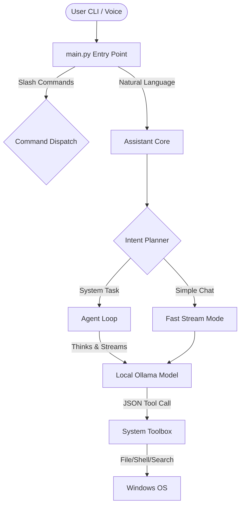

<div align="center">

# Aradhya
**The 100% Local Operating Intelligence (OI) for Windows**

[](https://www.python.org/downloads/release/python-3100/)
[](https://ollama.ai/)
[](https://www.microsoft.com/)

Aradhya is a personal AI laptop assistant focused on system-level operation. It goes beyond simple chat by acting as an **Operating Intelligence (OI)** layer that can safely execute complex tasks on your local machine, with zero reliance on cloud APIs.

</div>

---

## 🌟 Why Aradhya?

While competitors focus on cloud-dependent REST APIs, Aradhya is built specifically for **privacy, speed, and Windows**.

* **Zero-Cloud Architecture:** Your data never leaves your laptop. Powered entirely by [Ollama](https://ollama.ai/).
* **Instant Streaming Responses:** No more waiting 30 seconds for a spinner. Watch the AI "think" and type in real-time.
* **Safe Agentic Execution:** Aradhya can parse complex system tasks, propose file modifications, and run shell commands, but features a strict **User Confirmation Gate** (`yes proceed`) before running destructive actions.
* **Voice-Native:** Push-to-talk live voice activation, wake word detection, and background audio processing pipelines built-in.

---

## 🏗️ System Architecture

Aradhya separates conversational Fast Chat from complex Agentic Loops to maximize responsiveness.



---

## 🚀 Quick Start

Get Aradhya running in under 2 minutes. 

### 1. Prerequisites
- Python 3.10 or higher
- [Ollama](https://ollama.ai/) installed with your preferred model (default: `gemma4:e4b`)

### 2. Installation
Clone the repository and run the setup wizard.

```powershell
git clone https://github.com/Saurabh0003M/ARADHYA.git aradhya
cd aradhya
.\scripts\first_run.bat
```

### 3. Launch
To start Aradhya at any time, just run:

```powershell
.\arise.bat
```

> [!TIP]
> **Try typing:** `hello, who are you?` for a fast chat response, or `find all python files modified today in my documents folder` to trigger an agentic background task.

---

## 📂 Project Structure

Aradhya is built with a clean, modular package architecture:

```text
aradhya/
├── core/
│   ├── config/          # Central configuration (profile.json, preferences.json)
│   ├── logs/            # Audit and system logs
│   └── skills/          # Dynamically loaded SKILL.md toolsets
├── scripts/             # Windows batch utilities (first_run, doctor)
└── src/aradhya/
    ├── channels/        # Remote connections (e.g., Telegram Bot)
    ├── providers/       # LLM Backends (Ollama, etc.)
    ├── tools/           # System operation tool definitions
    ├── ui/              # Rich CLI rendering and formatting
    ├── utils/           # Shared extraction and logging utilities
    ├── voice/           # Microphone, wake word, and TTS pipeline
    ├── agent_loop.py    # Multi-step reasoning loop 
    └── main.py          # Application entry point
```

---

## ⌨️ Command Reference

While Aradhya understands natural English effortlessly, you can use these quick slash commands:

### Core
- `/help` - Show all commands.
- `/status` - View current model health, execution policy, and loaded skills.
- `/sleep` - Put Aradhya into idle mode.
- `exit` - Close the assistant safely.

### Voice Integration
- `/voice activate` - Start live push-to-talk microphone capture.
- `/voice stop` - Stop microphone capture.
- `/wake-word on` - Continuously listen for "Wake up" or "Arise".

### Safety & Auditing
- `/audit` - Show recent tool executions and shell commands run by the AI.

---

## 🛠️ Configuration

Aradhya's behavior is controlled via `core/config/preferences.json` and `core/config/profile.json`.

* **`allow_live_execution`:** If `false`, Aradhya dry-runs actions instead of actually running shell commands.
* **`model_name`:** Switch to any local model pulled via Ollama (e.g. `llama3`, `phi3`).

*Note: You can safely place machine-specific overrides in `profile.local.json` without dirtying git tracking.*
