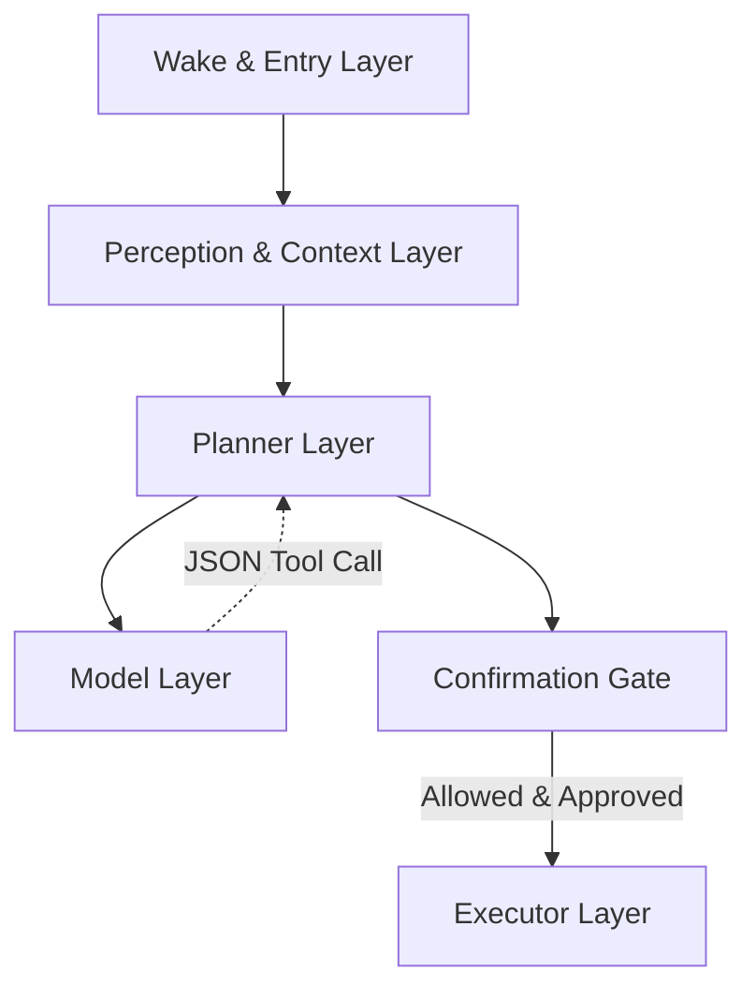
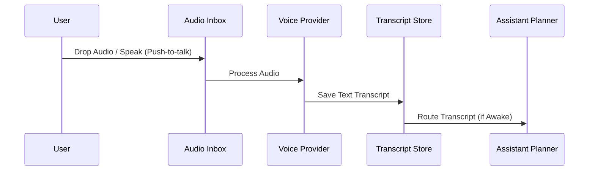

# Aradhya Architecture

## Product Direction

Aradhya is an **Operating Intelligence (OI)**: a personal AI laptop assistant that understands natural-language requests about the machine itself, aggregates context, plans a safe action, and executes only after the user explicitly confirms. The design favors system control, workflow acceleration, and coordination over generic text generation.

## Core Principles

1. Wake explicitly through a floating icon, the `Ctrl + Win` hotkey, or Telegram.
2. Echo the transcript/request so the user can verify what Aradhya heard.
3. Plan before acting.
4. Require an explicit confirmation phrase (such as `yes proceed`) for device-affecting actions.
5. Provide multi-layered safety via Hook Engines and Permission Rules.
6. Refresh local context dynamically (clipboard, active windows, fast file indices).

## Runtime Layers

### 1. Wake & Entry Layer
* **Trigger sources:** Floating Icon, global hotkeys, Daemon API, Telegram bots.
* **Responsibility:** Move from idle to active state; accept inputs.
* **Side effect:** Refresh local directory index.

### 2. Perception & Context Layer
* **Vision:** Screen capture and OCR.
* **Speech-to-Text:** Whisper integration into a voice inbox pipeline.
* **Telemetry:** Active window titles, clipboard, recent files.
* **State Store:** Thread-safe WAL SQLite for memory and continuity.

### 3. Planner Layer
* Converts transcripts into structured ReAct execution plans.
* Uses deterministic routing for crisp commands, falls back to local models.
* Requires model to output strict JSON tool calls.
* Determines context required (local files, external tools, SKILLs).

### 4. Confirmation Gate
* **Safety Pipeline:** Passes through `HookEngine` and `PermissionEngine`.
* **User Approval:** Pauses behind explicit approval (`yes proceed`).
* **Dry-run:** Operates read-only unless live execution enabled.

### 5. Executor Layer
* **Tool Registry:** Browser, File, Power, Scheduler, Session, Shell, System, Vision, Web.
* Supports stateful workflows (browser automation, background tasks).
* Integrates with `SKILL.md` definitions and custom agents.

### 6. Model Layer
* Configured in `profile.local.json`.
* **Providers:** Ollama (default), OpenRouter (fallback behind `CloudPrivacyGate`).

## Local Data Strategy

Aradhya maintains a text snapshot of the visible directory tree in `project_tree.txt`, augmented by fast path-heuristics.

- Refresh on wake or on specific local-data requests.
- Skip rules ignore noisy directories such as `venv`, `node_modules`, `.git`, and caches.
- Utilizes node caps to maintain responsiveness on exceptionally large disks.
- Employs token-aware history compaction (e.g. merging 60 older messages into a synthesized context block) to preserve LLM token budgets.

## Current Supported Task Types

- Comprehensive browser automation (navigating, typing, clicking, capturing DOM elements).
- Vision-assisted screen reading and interpretation.
- Opening paths, launching applications, managing sleep/power states, and managing the system clipboard.
- Interrogating project environments using localized Git and dependency awareness.
- Executing detailed, structured engineering sprints (via the Sprint Factory).
- Scheduling recurring background system tasks.

## Voice Workflow Today

1. Drop audio into `audio/inbox`.
2. Process it through the configured voice provider (e.g. `manual_transcript` or `faster_whisper`).
3. Save the transcript into `audio/transcripts`.
4. Route the transcript into the assistant planner when Aradhya is awake.

When live voice activation is enabled via push-to-talk hotkeys or wake-word listeners ("wakeup", "arise"), microphone captures are routed transparently into the same inbox/transcript/archive workflow. This ensures that debugging, transcript inspection, and safety behaviors remain entirely consistent across text and voice.

## Long-Term Vision

The long-term target is **Aradhya OS**: an operating environment designed fundamentally around the assistant, replacing the concept of embedding an assistant inside a conventional desktop workflow. The operating system *is* the intelligence.
