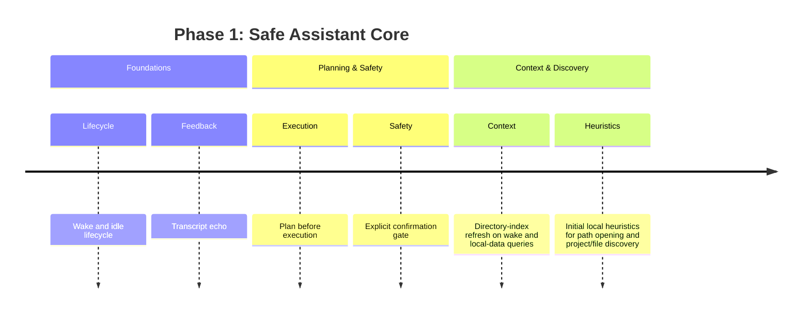

# Phase 1

Phase 1 establishes the safe assistant core.

- Wake and idle lifecycle.
- Transcript echo.
- Plan before execution.
- Explicit confirmation gate.
- Directory-index refresh on wake and local-data queries.
- Initial local heuristics for path opening and project/file discovery.
