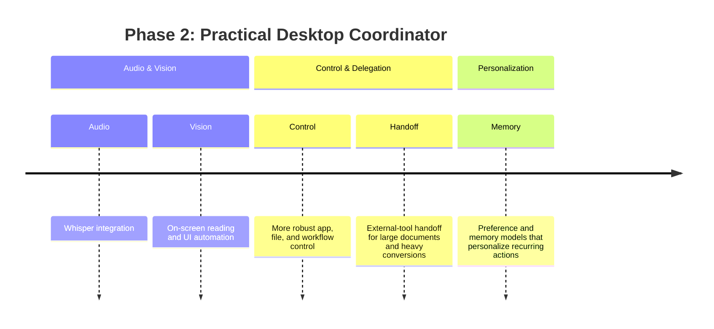

# Phase 2

Phase 2 expands Aradhya into a practical desktop coordinator.

- Whisper integration.
- On-screen reading and UI automation.
- More robust app, file, and workflow control.
- External-tool handoff for large documents and heavy conversions.
- Preference and memory models that personalize recurring actions.
