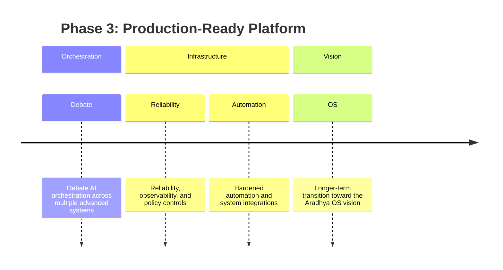

# Phase 3

Phase 3 pushes Aradhya toward a production-ready platform.

- Debate AI orchestration across multiple advanced systems.
- Reliability, observability, and policy controls.
- Hardened automation and system integrations.
- Longer-term transition toward the Aradhya OS vision.
