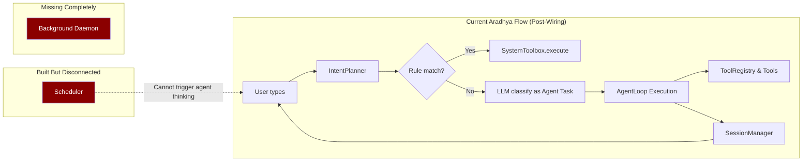

# Aradhya vs OpenClaw — Honest Gap Analysis (Post-Upgrade)

> [!CAUTION]
> **Honest truth**: We built the *framework* (skills, session manager, agent loop, tools, scheduler) and have now successfully **wired it into the main execution path**. Aradhya's `handle_transcript()` can now route complex requests to the full Agent Loop with memory, tool safety policies, and web access.

---

## Can Aradhya Work Overnight on a Project? 🔴 NO — Not Yet

Here's exactly why:

### What "Overnight Autonomous Work" Requires

```
User says: "Work on my project overnight. Check status, gather info,
           make changes, verify, repeat until morning."

This needs ALL of these to work together:
```

| Requirement | OpenClaw | Aradhya | Status |
|------------|---------|---------|--------|
| **Background daemon** that stays alive when terminal closes | ✅ Gateway daemon, systemd/launchd supervised | ❌ Dies when CLI closes | 🔴 Missing |
| **Agent loop** that runs tools and iterates automatically | ✅ Real tool-calling loop with model API | ✅ `AgentLoop` wired via `_execute_agent_task()` | 🟢 Done |
| **Tools that actually execute** (read code, run tests, write files) | ✅ `exec`, `read`, `write`, `apply_patch` all connected | ✅ File, Shell, and Session tools wired to registry | 🟢 Done |
| **Web search / fetch** to gather online info | ✅ `web_search`, `web_fetch`, `x_search` built-in | ✅ Native `web_search` and `web_fetch` implemented | 🟢 Done |
| **Session persistence** across hours of work | ✅ Full session transcript with compaction | ✅ Active session tracked and history passed to loop | 🟢 Done |
| **Progress checking** (run tests, read output, decide next step) | ✅ Multi-iteration agent loop + code execution tool | ❌ Planner can iterate but has no long-term memory of past loops | 🟡 Partial |
| **Auto-recovery** (retry on failure, handle errors) | ✅ Compaction retries, stuck-session recovery, timeout handling | ✅ Agent loop detects failed tool calls and retries | 🟢 Done |
| **48-hour timeout support** | ✅ `agents.defaults.timeoutSeconds` = 172800s (48hrs) | ❌ No concept of long-running background tasks | 🔴 Missing |
| **Heartbeat system** (periodic check-ins without user input) | ✅ `HEARTBEAT.md` — runs every 30 min automatically | ❌ Scheduler exists but can only run shell commands | 🟡 Partial |

### The Core Problem



**The agent loop, tool registry, and session manager are fully wired.** However, Aradhya lacks a daemon to survive terminal closure and an autonomous heartbeat/scheduler to drive tasks while you sleep.

---

## Complete Gap Table: OpenClaw vs Aradhya

### 🔴 Critical Gaps (Things OpenClaw Can Do That Aradhya Cannot)

| # | Feature | OpenClaw Has | Aradhya Has | Gap |
|---|---------|-------------|-------------|-----|
| 1 | **Background Daemon** | Gateway runs as a long-lived process supervised by systemd/launchd. Survives terminal close, system restart. WebSocket API for remote control. | CLI process — dies when terminal closes. No background mode, no API server, no service registration. `daemon.py` and `api_server.py` were planned but not built. | **No way to run overnight.** Process dies when you close the terminal. |
| 2 | **Code Execution Sandbox** | `code_execution` tool — runs Python/JS/etc. in sandboxed Docker environments. | `run_command` tool runs directly on the host shell. | **Security risk for autonomous code.** No isolation. |
| 3 | **Multi-Step Task Flow** | `openclaw tasks flow` — durable multi-step workflow orchestration. Steps persist, resume after failure, track progress. | No concept of durable multi-step tasks. Each loop iteration is independent. | **Cannot chain "check status → gather info → make changes → verify → repeat" across long periods.** |
| 4 | **Streaming Responses** | Real-time token streaming from model to user via WebSocket. User sees the AI thinking in real-time. | Synchronous: waits for full model response, then prints. | **Feels slow and unresponsive** on complex queries. |

### 🟡 Important Gaps

| # | Feature | OpenClaw | Aradhya |
|---|---------|---------|---------|
| 5 | **Multi-Model Routing** | 15+ providers (OpenAI, Anthropic, Google, Ollama, Groq, Together, etc.) with automatic failover. Model-per-agent configuration. | Ollama only. `model_provider.py` has one provider. |
| 6 | **Heartbeat System** | `HEARTBEAT.md` — gateway runs a heartbeat every 30 minutes, agent checks inbox, calendar, notifications, executes due tasks. | `scheduler.py` can run shell commands on intervals, but cannot trigger the agent to think and act. |
| 7 | **Plugin System** | npm-based plugin installation, SDK for building plugins, 12+ community plugins, lifecycle hooks. | No plugin system. Everything is monolithic source code. |

### 🟢 Addressed / Completed Gaps (Recently Fixed)

| # | Feature | Status | Implementation Details |
|---|---------|--------|------------------------|
| ✅ | **Live Agent Loop** | Fixed | `AgentLoop` is fully wired into `assistant_core.py`. |
| ✅ | **Real Web Tools** | Fixed | `web_search` and `web_fetch` are native and wired. |
| ✅ | **Exec Approvals** | Fixed | Implemented `ToolRuntimePolicy` with path enforcement and mutation grants. |
| ✅ | **Standing Orders** | Fixed | `rules.md` and `notes.md` are injected automatically. |
| ✅ | **File Edit Tools** | Fixed | `ALL_FILE_TOOLS` are registered and accessible. |
| ✅ | **Tool-Loop Detection** | Fixed | Iterations and repeat loops are bounded by `max_iterations=10`. |

---

## What Needs to Happen for Overnight Autonomous Work

> [!IMPORTANT]
> These are the **remaining requirements** for Aradhya to work autonomously on a project overnight.

### Priority 1: Background Daemon
1. Build `daemon.py` — system tray + background thread
2. Build `api_server.py` — HTTP API for sending commands
3. Process must survive terminal close

### Priority 2: Autonomous Task Runner (Heartbeat)
1. Build a "project work" mode: user defines a long-term goal, agent loops until done
2. Implement the heartbeat: agent wakes up every N minutes, checks progress, continues
3. Connect the `Scheduler` to the `AgentLoop`.

### Priority 3: Streaming & UX
1. Add token streaming to the CLI output so the user doesn't stare at a blank screen during long agent loops.
