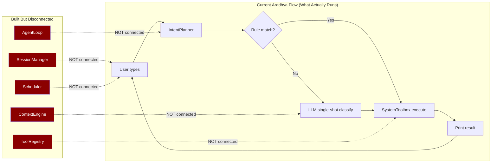

# Aradhya vs OpenClaw — Honest Gap Analysis (Post-Upgrade)

> [!CAUTION]
> **Honest truth**: We built the *framework* (skills, session manager, agent loop, tools, scheduler) but most of it is **not yet wired into the actual execution path**. The modules exist as independent components, but Aradhya's `handle_transcript()` still routes through the old `IntentPlanner → SystemToolbox.execute()` pipeline. The new agent loop, tools, and session manager are sitting there unused.

---

## Can Aradhya Work Overnight on a Project? 🔴 NO — Not Yet

Here's exactly why:

### What "Overnight Autonomous Work" Requires

```
User says: "Work on my project overnight. Check status, gather info,
           make changes, verify, repeat until morning."

This needs ALL of these to work together:
```

| Requirement | OpenClaw | Aradhya | Status |
|------------|---------|---------|--------|
| **Background daemon** that stays alive when terminal closes | ✅ Gateway daemon, systemd/launchd supervised | ❌ Dies when CLI closes | 🔴 Missing |
| **Agent loop** that runs tools and iterates automatically | ✅ Real tool-calling loop with model API | ❌ `agent_loop.py` exists but is NOT connected to `handle_transcript()` | 🔴 Built but not wired |
| **Tools that actually execute** (read code, run tests, write files) | ✅ `exec`, `read`, `write`, `apply_patch` all connected | ❌ `file_tools.py`, `shell_tools.py` exist but nothing calls them | 🔴 Built but not wired |
| **Web search / fetch** to gather online info | ✅ `web_search`, `web_fetch`, `x_search` built-in | ❌ No actual web search implementation | 🔴 Missing |
| **Session persistence** across hours of work | ✅ Full session transcript with compaction | ❌ `session_manager.py` exists but `assistant_core.py` doesn't use it | 🟡 Built but not wired |
| **Progress checking** (run tests, read output, decide next step) | ✅ Multi-iteration agent loop + code execution tool | ❌ Planner is single-shot classify → execute | 🔴 Missing |
| **Auto-recovery** (retry on failure, handle errors) | ✅ Compaction retries, stuck-session recovery, timeout handling | ❌ No error recovery | 🔴 Missing |
| **48-hour timeout support** | ✅ `agents.defaults.timeoutSeconds` = 172800s (48hrs) | ❌ No concept of long-running tasks | 🔴 Missing |
| **Heartbeat system** (periodic check-ins without user input) | ✅ `HEARTBEAT.md` — runs every 30 min automatically | ❌ Scheduler exists but can only run shell commands | 🟡 Partial |

### The Core Problem



**The agent loop, tool registry, session manager, and context engine are built as standalone modules but nothing in the main execution path calls them.** The CLI still uses the old `IntentPlanner → SystemToolbox` pipeline.

---

## Complete Gap Table: OpenClaw vs Aradhya

### 🔴 Critical Gaps (Things OpenClaw Can Do That Aradhya Cannot)

| # | Feature | OpenClaw Has | Aradhya Has | Gap |
|---|---------|-------------|-------------|-----|
| 1 | **Live Agent Loop** | Real tool-calling cycle: prompt → model → tool calls → execute → loop until done. Model decides which tools to call and when to stop. 48-hour timeout support. | `agent_loop.py` exists but is not connected to `handle_transcript()`. The planner still does single-shot classification and routes to `SystemToolbox.execute()`. | **The loop exists but isn't plugged in.** Need to replace the `IntentPlanner → SystemToolbox` pipeline with `AgentLoop → ToolRegistry`. |
| 2 | **Background Daemon** | Gateway runs as a long-lived process supervised by systemd/launchd. Survives terminal close, system restart. WebSocket API for remote control. | CLI process — dies when terminal closes. No background mode, no API server, no service registration. `daemon.py` and `api_server.py` were planned but not built. | **No way to run overnight.** Process dies when you close the terminal. |
| 3 | **Real Web Tools** | `web_search` (search engines), `web_fetch` (fetch any URL), `x_search` (Twitter/X search), `browser` (full browser automation). All connected to the agent loop and callable by the model. | `web-search` skill YAML exists but there is no actual Python code that performs a web search. No browser automation code. | **Cannot gather online info.** The skill describes the capability but doesn't implement it. |
| 4 | **Code Execution Tool** | `code_execution` tool — runs Python/JS/etc. in sandboxed environments. Model can write code, execute it, read output, iterate. | `run_command` tool exists (shell execution) but is not connected to the agent loop and has no sandboxing. | **Cannot autonomously write and test code.** |
| 5 | **Multi-Step Task Flow** | `openclaw tasks flow` — durable multi-step workflow orchestration. Steps persist, resume after failure, track progress. | No concept of multi-step tasks. Each interaction is independent. | **Cannot chain "check status → gather info → make changes → verify → repeat."** |
| 6 | **Streaming Responses** | Real-time token streaming from model to user via WebSocket. User sees the AI thinking in real-time. | Synchronous: waits for full model response, then prints. | **Feels slow and unresponsive** on complex queries. |

### 🟡 Important Gaps

| # | Feature | OpenClaw | Aradhya |
|---|---------|---------|---------|
| 7 | **Multi-Model Routing** | 15+ providers (OpenAI, Anthropic, Google, Ollama, Groq, Together, etc.) with automatic failover. Model-per-agent configuration. | Ollama only. `model_provider.py` has one provider. Cloud model providers were planned but not built. |
| 8 | **Exec Approvals** | Fine-grained approval system: `auto-approve` regex patterns for safe commands, `ask` for unknown commands, `deny` for dangerous ones. Per-directory and per-command rules. | Binary `allow_live_execution` flag. Either everything needs confirmation or nothing does. |
| 9 | **Heartbeat System** | `HEARTBEAT.md` — gateway runs a heartbeat every 30 minutes, agent checks inbox, calendar, notifications, executes due tasks. | `scheduler.py` can run shell commands on intervals, but cannot trigger the agent to think and act. |
| 10 | **Standing Orders** | `AGENTS.md` — persistent instructions that are always injected into the system prompt. Agent follows them automatically every session. | `rules.md` exists in `core/memory/user_context/` but is not read or injected into any prompt. |
| 11 | **Plugin System** | npm-based plugin installation, SDK for building plugins, 12+ community plugins, lifecycle hooks (before_tool_call, after_tool_call, etc.). | No plugin system. Everything is monolithic source code. Skills are prompt-only, no code execution. |
| 12 | **File Edit Tools** | `read`, `write`, `edit`, `apply_patch` — full file manipulation connected to the agent loop. Model can read code, edit it, and verify changes. | `file_tools.py` has `read_file`, `write_file`, `list_directory`, `search_files` but they're not connected to the agent loop. |

### 🟢 Medium Gaps

| # | Feature | OpenClaw | Aradhya |
|---|---------|---------|---------|
| 13 | **Sub-Agents** | Spawn specialized agents for sub-tasks. Delegate "research this" to a web-focused agent, "code this" to a coding agent. | No multi-agent concept. |
| 14 | **Channel Docking** | Connect the same session across WhatsApp, Telegram, Discord, CLI. Switch channels mid-conversation. | CLI only. |
| 15 | **Image/Music/Video Generation** | `image_generate`, `music_generate`, `video_generate` tools via cloud APIs. | No media generation. |
| 16 | **PDF Tool** | Read and process PDF files. | No PDF support. |
| 17 | **Sandboxing** | Docker containers for safe code execution. | No sandboxing. `dry-run` mode only. |
| 18 | **Tool-Loop Detection** | Detects when the agent is stuck calling the same tools repeatedly and breaks the loop. | No loop detection in the (disconnected) agent loop. |
| 19 | **OAuth** | OAuth2 flow for secure API access to Google, GitHub, etc. | No OAuth. |
| 20 | **MCP Support** | Model Context Protocol for standardized tool/context integration. | No MCP. |
| 21 | **TTS Quality** | ElevenLabs, Google TTS, OpenAI TTS with high-quality voices. | pyttsx3 (offline, robotic). |
| 22 | **Skill Marketplace** | ClawHub — community skill sharing and discovery. | No marketplace. Local skills only. |

---

## What Aradhya DOES Have That OpenClaw Doesn't

| Feature | Aradhya | OpenClaw |
|---------|---------|---------|
| **Zero cloud dependency** | Works 100% offline with Ollama | Requires cloud API keys for most features |
| **Windows-native** | Built for Windows, uses Win32 APIs | Primarily macOS/Linux, Windows is secondary |
| **Floating desktop icon** | tkinter-based floating wake icon | No desktop presence on Windows |
| **Wake word detection** | Push-to-talk + wake word listener | Has voice but via plugins, not native |
| **Simple, readable codebase** | ~3000 lines of Python, easy to understand | 38K+ commits, massive TypeScript codebase |
| **Rule-based fast path** | Deterministic intent matching before LLM | Everything goes through the model |

---

## What Needs to Happen for Overnight Autonomous Work

> [!IMPORTANT]
> These are the **minimum requirements** for Aradhya to work autonomously on a project overnight.

### Priority 1: Wire the Agent Loop (makes everything else possible)
1. Replace `handle_transcript()` → `IntentPlanner` → `SystemToolbox` with `AgentLoop` → `ToolRegistry`
2. Connect all built tools (file, shell, system, session) to the `ToolRegistry`
3. Inject session history + context engine output into the agent loop
4. Implement proper function-calling via Ollama API (Ollama supports tool calling now)

### Priority 2: Background Daemon
1. Build `daemon.py` — system tray + background thread
2. Build `api_server.py` — HTTP API for sending commands
3. Register as Windows startup task
4. Process must survive terminal close

### Priority 3: Real Web Tools
1. Implement actual `web_search()` using DuckDuckGo or SearXNG (free, no API key)
2. Implement `web_fetch()` using `requests` + `beautifulsoup4`
3. Connect both to the tool registry

### Priority 4: Autonomous Task Runner
1. Build a "project work" mode: user defines a goal, agent loops until done
2. Implement the heartbeat: agent wakes up every N minutes, checks progress, continues
3. Add progress logging so you can see what happened while you slept
4. Add safety limits: max iterations, max file changes, restricted directories

### Priority 5: Standing Orders & Rules Integration
1. Read `rules.md` and inject into system prompt
2. Read `standing_orders.md` for persistent task instructions
3. These tell the agent "work on X project, focus on Y, don't touch Z"

---

## Summary

| Category | Built | Wired/Working | Gap |
|----------|-------|---------------|-----|
| Skills System | ✅ 5 skills | ✅ Loaded + injected into LLM prompt | ✅ Complete |
| Session Manager | ✅ Full implementation | ❌ Not used by `assistant_core.py` | 🟡 Needs wiring |
| Context Engine | ✅ Full implementation | ❌ Not used anywhere | 🟡 Needs wiring |
| Agent Loop | ✅ Full implementation | ❌ Not connected to main flow | 🔴 Needs wiring |
| Tool Registry | ✅ 10 tools defined | ❌ Not connected to agent loop | 🔴 Needs wiring |
| Task Scheduler | ✅ Basic scheduler | ❌ Can't trigger agent thinking | 🟡 Needs upgrade |
| Background Daemon | ❌ Not built | ❌ | 🔴 Critical for overnight |
| Web Search | ❌ Not built | ❌ | 🔴 Critical for research |
| Browser Automation | ❌ Not built | ❌ | 🟡 Can wait |
| Multi-Model | ❌ Not built | ❌ | 🟡 Can wait |
| Task Flow | ❌ Not built | ❌ | 🔴 Critical for overnight |
| Streaming | ❌ Not built | ❌ | 🟡 UX improvement |

**Bottom line**: Aradhya has strong foundations (skills, session, tools, agent loop) but they're like engine parts sitting on a workbench — not yet assembled into a running car. The overnight autonomous work scenario requires wiring everything together + building the daemon + real web tools.
