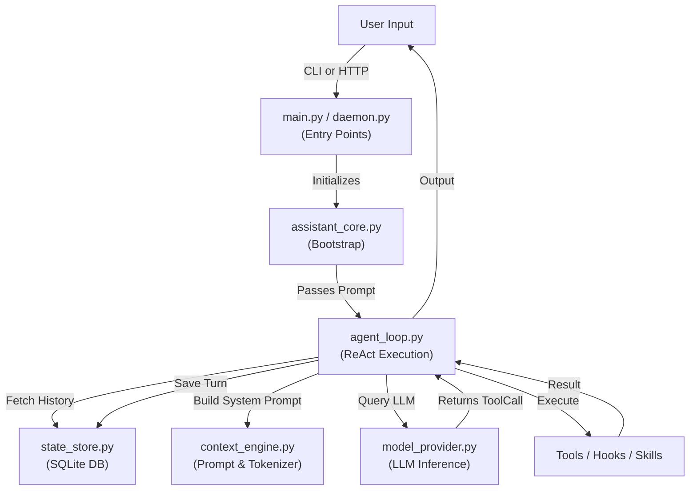

# Core Engine (`src/aradhya/`)

## Module Overview
This is the root of the Aradhya Operating Intelligence application. It contains the central orchestration logic, state management, ReAct (Reason+Act) execution loops, and the main entry points. It acts as the central nervous system, tying together all the peripheral modules (Parasite, Skills, Hooks, Tools).

## System Architecture

---

## Deep Dive: Files & Mechanisms

### 1. The Entry Points (`main.py` & `daemon.py`)
**Role:** The physical interfaces for the user.
**Mechanisms:**
- **`main.py`:** The CLI shell. It handles direct TTY interaction and parses slash commands (e.g., `/chat`, `/parasite`, `/setup`, `/voice`). It initializes a single `AssistantCore` instance for the lifetime of the command.
- **`daemon.py`:** A persistent background process. It detaches from the terminal and runs a lightweight HTTP server (`daemon_api.py`). This enables the system tray icon, floating desktop widget, scheduled cron tasks, and Telegram bot triggers to wake up the agent without opening a terminal window.

### 2. `assistant_core.py` (The Bootstrapper)
**Role:** Wires the dependencies together.
**Mechanisms:**
- Instantiates the `ToolRegistry` and scans the `tools/` folder.
- Instantiates the `HookEngine` by pointing it at `hooks.json`.
- Connects to the SQLite DB via `state_store.py`.
- Instantiates the `AgentLoop`. When `main.py` passes a user prompt, `assistant_core` acts as a facade, forwarding the prompt to the loop and handling graceful interruptions (Ctrl+C).

### 3. `agent_loop.py` (The ReAct Loop)
**Role:** The cognitive engine driving autonomous behavior.
**Mechanisms:**
- **The Loop:** It takes a prompt, asks the `model_provider`, and receives either text or tool calls. If it receives tool calls, it executes them and feeds the result *back* into the model. This loop continues until the model outputs final text without calling any tools.
- **The Gates:** During tool execution, the loop explicitly triggers the `HookEngine` (`PRE_TOOL_USE` / `POST_TOOL_USE`) and the `ConfirmationGate` (checking if the tool requires manual UI approval before execution).
- **Subagent Hooks:** It checks if the current loop is running inside a subagent thread; if so, it hooks into the `SubagentMessenger` to receive asynchronous interrupts from its parent.

### 4. `context_engine.py` & `context_compressor.py`
**Role:** Manages what the LLM can "see".
**Mechanisms:**
- **Prompt Construction:** Before querying the LLM, the `context_engine` builds the massive system prompt. It dynamically injects:
  1. The OS environment details (Windows, path, cwd).
  2. The `rules.md` file (populated by the `learnings` module).
  3. The active `SKILL.md` instructions (filtered by the `skills` module based on user intent).
- **Token Compression:** If the conversation history stored in SQLite gets too large for the LLM's context window, `context_compressor.py` uses a lightweight LLM call to summarize older turns, seamlessly replacing them in the active prompt to prevent token limit crashes while preserving memory.

### 5. `state_store.py` (The Database)
**Role:** Persistent, thread-safe memory.
**Mechanisms:**
- Uses SQLite with thread-local connections to prevent DB locks when multiple subagents are running concurrently.
- Tables include `sessions` (conversation metadata), `turns` (user vs model messages), and `tool_calls` (an exact audit log of what arguments were passed to what tool and what the output was).

### 6. `model_provider.py` & `cloud_safety.py`
**Role:** LLM Inference abstraction.
**Mechanisms:**
- Automatically attempts to use `Ollama` for local, private inference on `localhost:11434`.
- If the local model crashes or is too slow, it falls back to `OpenRouter` for cloud inference.
- **Privacy Gate:** Before falling back to the cloud, `cloud_safety.py` evaluates the active context. If the prompt contains file contents from a `.env` file, private ssh keys, or matches a "high-sensitivity" regex, the gate hard-blocks the network request, forcing the system to fail gracefully rather than leaking data to the cloud.
