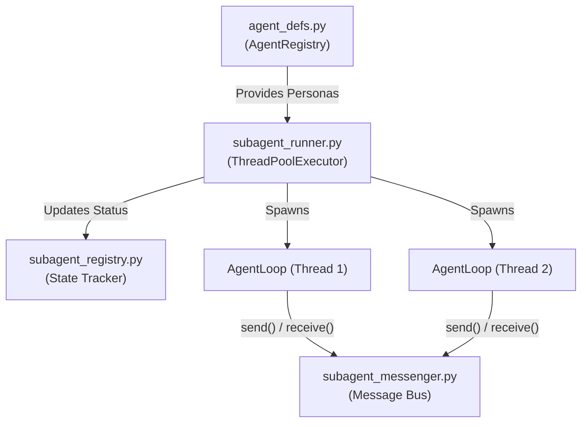

# Agents Module (`src/aradhya/agents`)

## Module Overview
The Agents module is the multi-processing heart of Aradhya. It transitions the application from a single chat assistant into a **multi-agent orchestration system**. It provides the infrastructure to parse agent personas, spawn them in concurrent background threads, track their execution lifecycle, and allow them to communicate with each other via a thread-safe message bus.

## System Architecture

---

## Deep Dive: Files & Mechanisms

### 1. `agent_defs.py` (Persona Loading)
**Role:** Parses agent definition files from disk and holds them in memory.
**Mechanisms:**
- **Markdown + YAML Format:** Agents are defined using Markdown files containing YAML frontmatter (similar to Claude Code). 
- **`AgentDefinition`:** The parser extracts fields like `name`, `description`, `system_prompt`, `model`, `max_turns`, and specific `tools` or `disallowed_tools`.
- **`AgentRegistry`:** Scans `~/.aradhya/agents/` and the local project's `.aradhya/agents/` to load these definitions into memory at startup. Project-level definitions override global definitions with the same name.

### 2. `subagent_runner.py` (The Execution Engine)
**Role:** Spawns and manages the concurrent execution of subagents.
**Mechanisms:**
- **`ThreadPoolExecutor`:** Uses a Python thread pool (default 4 workers) to allow multiple ReAct agent loops to run simultaneously in the background without blocking the main CLI or Daemon thread.
- **`AgentLoopFactory` Injection:** To avoid circular imports, `assistant_core.py` injects a factory function into the runner at startup. When `spawn()` is called, the runner uses this factory to spin up a completely isolated `AgentLoop` with its own scoped session and filtered `ToolRegistry`.
- **Lifecycle Management:** Exposes methods like `spawn()`, `get_result()` (with blocking timeouts), `kill()`, and `kill_all()`.
- **Parent-Child Notifications:** Automatically sends a message (via the Messenger) to the parent agent when a child subagent finishes its task (`SubagentStatus.COMPLETED`) or crashes (`SubagentStatus.FAILED`).

### 3. `subagent_messenger.py` (Inter-Agent Communication)
**Role:** A thread-safe message bus for agents.
**Mechanisms:**
- **`SubagentMessenger` Singleton:** Maintains a dictionary of `queue.Queue` objects, one for every registered subagent.
- **Ring-Buffer Queues:** Queues are bounded (`MAX_QUEUE_SIZE = 500`). If an agent is spamming messages to a frozen agent, the messenger automatically drops the oldest messages to prevent out-of-memory (OOM) crashes.
- **Communication Patterns:**
  - **Point-to-Point (`send`):** Delivers a message directly to a specific `subagent_id`.
  - **Broadcast (`broadcast`):** Delivers a message to all currently active agents.
  - **Blocking Reads (`receive`):** Agents can pause their execution and block on the queue with a timeout to wait for a peer to reply.

### 4. `subagent_registry.py` (Lifecycle Tracking)
**Role:** The source of truth for the status of all agents.
**Mechanisms:**
- Manages `SubagentInfo` dataclasses which track the `role`, `parent_id`, and `status`.
- Valid statuses follow a strict state machine: `PENDING` -> `RUNNING` -> (`COMPLETED` | `FAILED` | `CANCELLED`).
- Used by the UI and CLI to render active background tasks to the user.

## Summary of Relationships
When the user types `/teamwork-preview` or an agent calls the `invoke_subagent` tool, the request goes to **`subagent_runner.py`**. The runner pulls the requested persona from **`agent_defs.py`**, registers the new task in **`subagent_registry.py`**, provisions a message queue in **`subagent_messenger.py`**, and finally throws the task into a background thread. While running, the new agent talks to its peers exclusively through the messenger bus.
