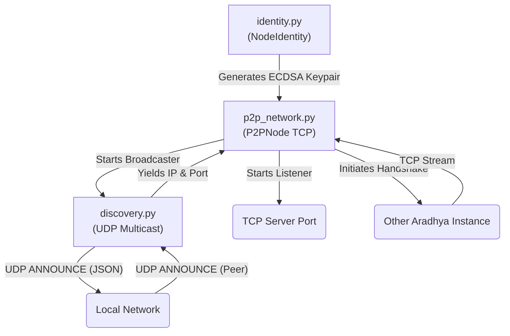

# Federation Module (`src/aradhya/federation`)

## Module Overview
The Federation module transforms Aradhya from a single isolated desktop assistant into a **peer-to-peer (P2P) swarm intelligence**. It allows multiple Aradhya instances running on different physical machines across the same Local Area Network (LAN) to automatically discover each other, verify identities, form a mesh network, and seamlessly delegate tasks or share compute resources (e.g., passing a heavy LLM task to a machine with a better GPU).

## System Architecture

---

## Deep Dive: Files & Mechanisms

### 1. `identity.py` (Cryptographic Identity)
**Role:** Generates and manages the unique, cryptographically verifiable identity of the local Aradhya instance.
**Mechanisms:**
- **ECDSA Keypairs:** Uses the `ecdsa` package (secp256k1 curve, same as Bitcoin) to generate a public/private keypair upon first boot.
- **NodeIdentity:** These keys are stored in `~/.aradhya/federation/identity.json`.
- **`peer_id` Generation:** Calculates the SHA-256 hash of the serialized public key to generate a unique, collision-resistant identifier (e.g., `arid_7f3b...`) representing the machine in the swarm.

### 2. `discovery.py` (Local Network Scanning)
**Role:** Allows Aradhya to find other instances on the LAN without relying on a central server.
**Mechanisms:**
- **UDP Multicast:** Implements the `LocalDiscovery` class which opens a UDP multicast socket (by default on port `54321` and multicast group `224.0.0.251`).
- **The Heartbeat:** It periodically broadcasts an `ANNOUNCE` JSON packet over the network. This packet contains the node's `peer_id`, the TCP port it is listening on, and its `capabilities` (e.g., `["gpu_inference", "web_search"]`).
- **Listener Callbacks:** Simultaneously, it listens for `ANNOUNCE` packets from other IP addresses. When it sees a valid packet from a new `peer_id`, it triggers a callback function, passing the peer's IP address and TCP port to the network manager.

### 3. `p2p_network.py` (The Mesh Network)
**Role:** Establishes and manages the actual data connections between instances.
**Mechanisms:**
- **`asyncio` Streams:** Implements a high-performance `P2PNode` using Python's native `asyncio.start_server` to accept incoming TCP connections.
- **The Handshake:** When `discovery.py` finds a peer, `P2PNode` attempts an `asyncio.open_connection()` to that IP/Port. Once connected, the nodes exchange a handshake packet containing their public keys. Currently, this forms a trusted link, but the foundation is laid for challenge-response cryptographic verification.
- **Task Delegation (The Message Bus):** Once the mesh is formed, the `P2PNode` provides `send_message(peer_id, payload)` and `broadcast(payload)` methods. These are hooked into the core `AgentLoop`'s tool registry.
- **Federated compute:** If the user asks Aradhya to "run this heavy analysis on the desktop PC", the local agent uses the P2P message bus to serialize the prompt, transmit it to the desktop peer, and wait asynchronously for the response payload to return over the TCP stream.

## Summary of Relationships
On startup, **`p2p_network.py`** requests an identity from **`identity.py`** and starts a TCP server. It then starts **`discovery.py`**. The discovery module shouts into the local network void using UDP. When another Aradhya instance shouts back, discovery notifies the P2P network, which then opens a direct TCP tunnel to the peer. From that point on, agents on both machines can exchange JSON payloads to collaborate.
