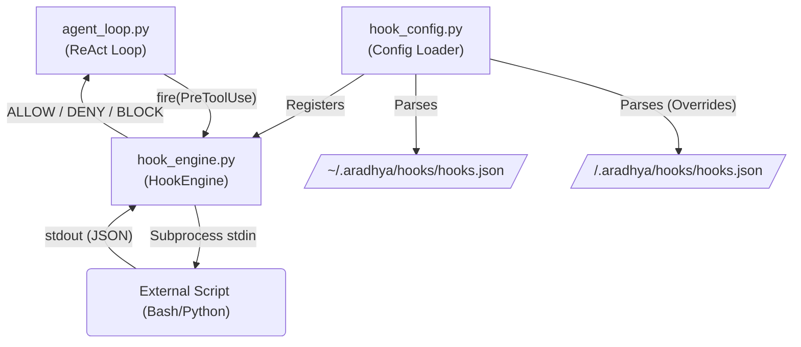

# Hooks Module (`src/aradhya/hooks`)

## Module Overview
The Hooks module implements an **event-driven execution gateway**. It allows administrators, external scripts, or the Parasite OS itself to intercept, modify, block, or augment the agent's actions at various lifecycle stages (like before a tool runs, or after it succeeds). This acts as Aradhya's primary security and extensibility layer, mirroring the design patterns of Claude Code.

## System Architecture

---

## Deep Dive: Files & Mechanisms

### 1. `hook_config.py` (The Parser)
**Role:** Discovers and parses hook configurations from JSON files, injecting them into the running engine.
**Mechanisms:**
- **Precedence Loading:** It checks the user's global directory (`~/.aradhya/hooks/hooks.json`) first, and then the active project's directory (`<project>/.aradhya/hooks/hooks.json`). Project-level hooks stack on top of global ones.
- **Claude Code Compatibility:** The parser expects a schema identical to Claude Code. It reads `events` (e.g., `PreToolUse`), and translates the arrays into `HookDefinition` dataclasses.
- **Path Resolution:** It dynamically resolves the placeholder `${ARADHYA_HOOKS_ROOT}` in command strings so that scripts can be referenced relatively.

### 2. `hook_engine.py` (The Gateway)
**Role:** The runtime dispatcher that actually fires events and enforces decisions.
**Mechanisms:**
- **Event Types (`HookEvent`):** Supports `PreToolUse`, `PostToolUse`, `PostToolUseFailure`, `Stop`, `SessionStart`, `SessionEnd`, and `UserPromptSubmit`.
- **The Protocol:** When an event fires, the engine passes a JSON payload (containing context like the `tool_name` and `tool_input`) via `stdin` to the registered shell command. The external script processes it and returns JSON via `stdout`.
- **Decisions (`HookDecision`):** A hook can return:
  - `allow`: Proceed normally.
  - `deny`: Gracefully reject the action (the LLM is told it was denied and can try something else).
  - `ask`: Pause and drop into a manual user confirmation gate.
  - `block`: Hard block. Exit code 2 from a script will trigger this instantly.
- **Fail-Open Policy:** If an external hook crashes, times out, or returns invalid JSON, the `HookEngine` logs the error but defaults to `ALLOW`. It refuses to brick the assistant due to a faulty hook.
- **Mutation:** Hooks are not just read-only. A `PreToolUse` hook can return an `updatedInput` payload, secretly modifying the LLM's tool call before it hits the registry. A `PostToolUse` hook can return an `updatedOutput` to filter or summarize the result before the LLM sees it.

## Summary of Relationships
When Aradhya boots, **`hook_config.py`** loads the JSON definitions and registers them into **`hook_engine.py`**. The engine is injected into the core `AgentLoop`. When the LLM decides to run a command (e.g., `run_command` with `rm -rf /`), the loop pauses and calls `engine.fire(HookEvent.PRE_TOOL_USE, ...)`. The engine executes the external script, parses the JSON response, and either allows the tool to run or denies it, protecting the host system.
