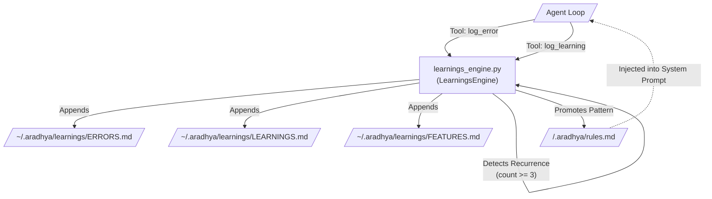

# Learnings Module (`src/aradhya/learnings`)

## Module Overview
The Learnings module provides Aradhya with **self-improvement capabilities**. It acts as a long-term memory system where the agent can log its failures, track user corrections, and note feature requests. Most importantly, it features an automated recurrence engine: if a specific mistake or correction occurs frequently, the module automatically promotes it to a permanent rule, permanently altering the agent's baseline behavior.

## System Architecture

---

## Deep Dive: Files & Mechanisms

### 1. `learnings_engine.py` (The Memory Ledger)
**Role:** Exposes agent tools to write to the memory ledgers, and silently monitors those ledgers for recurring patterns.
**Mechanisms:**
- **Agent Tools:** Exposes `@tool_definition` functions like `log_error`, `log_learning`, `log_feature_request`, and `search_learnings`. The agent is instructed (via its system prompt) to call these tools whenever it encounters a stubborn bug, receives a direct correction from the user, or realizes it made a bad assumption.
- **The Ledgers:** All logs are cleanly appended as timestamped Markdown entries into `~/.aradhya/learnings/ERRORS.md` and `LEARNINGS.md`. This makes the memory easily human-readable and editable.
- **The Self-Correction Loop (`_check_promotion`):** This is the core magic of the module.
  - Every time `log_learning` or `log_error` is called, the engine triggers `_check_promotion`.
  - It reads the recent history of the ledger and attempts to detect recurring themes. (Currently implemented via a lightweight keyword/substring matching heuristic to avoid expensive LLM calls on every log).
  - **Thresholding:** If it detects that a highly similar learning has been logged **3 or more times**, it triggers a promotion.
  - **Promotion:** The engine extracts the core lesson and forcefully appends it to the active project's `.aradhya/rules.md` file. 
- **The Feedback Loop:** Because `.aradhya/rules.md` is strictly loaded by the `ContextEngine` during the construction of the ReAct system prompt, promoting a learning to a rule guarantees that the agent will never repeat that mistake in the current repository again. The agent effectively "heals" its own bad behavior.

## Summary of Relationships
When an **Agent** fails a task, it uses the `log_error` tool provided by **`learnings_engine.py`**. The engine writes the failure to disk. Over time, as failures mount, the engine's internal `_check_promotion` logic crosses a threshold and modifies the `rules.md` file in the active workspace. On the very next conversation turn, the `Agent` reads that rule, completing the autonomous self-improvement loop.
