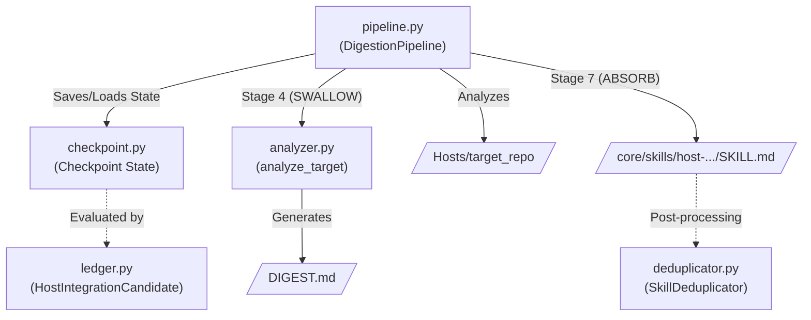

# Parasite OS Module (`src/aradhya/parasite`)

## Module Overview
The Parasite OS module is the engine for **dynamic capability acquisition**. It gives Aradhya the ability to safely "digest" external codebases (cloned into the `Hosts/` directory), analyze their contents, extract usable patterns, and synthesize them into local agent skills or data catalogs without risking system stability. It employs a rigid 7-stage state machine that checkpoints progress to survive crashes or interruptions.

## System Architecture

---

## Deep Dive: Files & Mechanisms

### 1. `pipeline.py` (The State Machine)
**Role:** The core orchestrator. It manages the `DigestionPipeline` class which drives a repository through 7 distinct stages.
**Mechanisms:**
- **Checkpoint Resilience:** Calls `load_checkpoint` at the start of `digest()`. If a failure occurred previously, it skips completed stages and resumes exactly where it left off.
- **The 7 Stages:**
  1. **ENGULF:** Basic metadata extraction (target path, file counts).
  2. **ISOLATE:** Security and trust scoring. Looks for `LICENSE` and `README.md`. If a GitHub URL and token are present, it dynamically fetches the repository's star count. `>1000` stars grants a `VERIFIED` trust score.
  3. **CHEW:** Verifies the target is safely isolated in the `Hosts/` directory.
  4. **SWALLOW:** Delegates to `analyzer.py` for deep semantic inspection. Generates the `DIGEST.md` summary.
  5. **DIGEST:** Formulates the integration plan (e.g., determining what artifacts to move).
  6. **EXTRACT:** A quality gate. Validates generated artifacts (like checking if an extracted data catalog is empty or filled with garbage).
  7. **ABSORB:** The final mutation. Moves validated artifacts into Aradhya's live tree. If the target contained valid capabilities (like an agent framework or MCP), it generates a functional `SKILL.md` (via `_generate_skill_file`) and places it in `core/skills/`.
- **Garbage Collection (`gc`):** Provides functionality to strip `.git` directories to save disk space, or archive/delete fully digested host repositories.

### 2. `analyzer.py` (Semantic Inspection)
**Role:** The analytical brain executed during the `SWALLOW` stage.
**Mechanisms:**
- **Language Detection (`_detect_project_type`):** Looks for `pyproject.toml`, `package.json`, `Cargo.toml`, or `go.mod` to classify the project.
- **Dependency Extraction:** Uses fast regex-based parsing (no heavy TOML/JSON parsers required) to extract dependencies directly from standard files.
- **Capability Detection (`_detect_capabilities`):** Uses keyword heuristics on the README to identify if the repo provides an `mcp_server`, `cli_tool`, `api_client`, `web_scraper`, `data_catalog`, or `agent_framework`.
- **Privacy Gating:** Runs the `CloudPrivacyGate` against the README to ensure no sensitive or blocked content is being processed.
- **Specialized Data Extraction:** Contains `analyze_public_apis_readme`, a bespoke parser that extracts tabular API lists from markdown files, validates HTTPS support, and generates a structured JSON catalog.

### 3. `checkpoint.py` (Persistence Layer)
**Role:** Provides atomic state tracking.
**Mechanisms:**
- Defines the `Checkpoint` and `StageResult` dataclasses.
- Saves state into `Hosts/<target>/.parasite/checkpoint.json`.
- Records the precise start time, end time, status (`running`, `completed`, `failed`), and error stack trace for every individual stage, ensuring the pipeline never repeats expensive LLM or IO operations unnecessarily.

### 4. `ledger.py` (Integration Prioritization)
**Role:** A post-digestion ranking engine.
**Mechanisms:**
- Scans all `.parasite/checkpoint.json` files and converts them into `HostIntegrationCandidate` objects.
- **Scoring Engine (`_score_candidate`):** Assigns points based on the value of the host. 
  - MCP servers yield high points (`+15`).
  - Agent frameworks yield (`+12`).
  - High trust scores (like `VERIFIED`) boost the score, while missing checkmarks penalize it.
  - Enormous repositories (>5000 files or >100 dependencies) are penalized to prevent Aradhya from wasting context windows on monolithic codebases.
- Assigns priority queues (`integrate-now`, `review-next`, `large-review`, `blocked`).

### 5. `deduplicator.py` (Capability Optimization)
**Role:** Keeps the active skills registry clean by detecting and merging overlapping skills generated from multiple digested hosts.
**Mechanisms:**
- **Deterministic Keyword Overlap:** Strips noise and calculates a mathematical overlap (Jaccard-like index) between the intents and descriptions of skills.
- **LLM Verification (`_llm_verify_duplicate`):** If mathematical overlap crosses a threshold (e.g., `0.5`), it calls the active LLM provider with a strict prompt, forcing the LLM to output exactly `MERGE` or `UNIQUE`.
- **Merge Operation:** If a merge is approved (and passes the user `ConfirmationGate`), the intents of the duplicate skill are safely injected into the YAML frontmatter of the base skill, and the duplicate's directory is physically deleted from the disk.

## Summary of Relationships
The **Pipeline** moves a target through discrete checkpoints handled by **checkpoint.py**. During the middle of the pipeline, **analyzer.py** is heavily utilized to understand the codebase. At the end of the pipeline, a `SKILL.md` is generated. Over time, **deduplicator.py** runs independently to compress these generated skills, while **ledger.py** provides a ranked view of all completed digestions so the core agent knows which targets offer the highest integration value.
