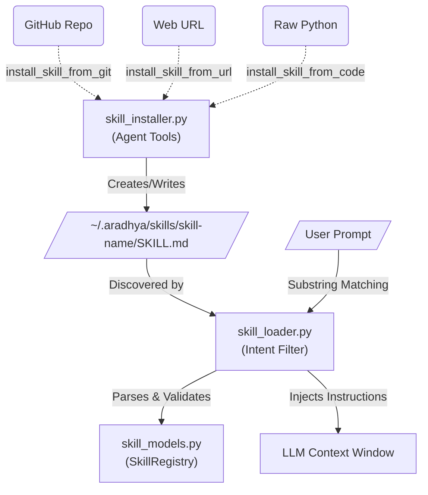

# Skills Module (`src/aradhya/skills`)

## Module Overview
The Skills module manages Aradhya's dynamic capabilities. It defines what a "Skill" is (a folder containing a `SKILL.md` file and optional Python tool modules), handles discovering and loading them into memory, and provides LLM-callable tools to install or uninstall new skills dynamically from GitHub, URLs, or raw code.

## System Architecture

---

## Deep Dive: Files & Mechanisms

### 1. `skill_installer.py` (Dynamic Acquisition)
**Role:** Exposes a suite of agent-facing `@tool_definition` functions that allow Aradhya to expand its own capabilities at runtime based on user requests.
**Mechanisms:**
- **`install_skill_from_git`:** The agent can clone an external Git repository directly into `~/.aradhya/skills/`. If the repository does not contain a native `SKILL.md` file, the installer automatically generates one by extracting the first 4000 characters of the `README.md`. It also detects if the repo has python tool modules (like `tools.py`).
- **`install_skill_from_url`:** Fetches content via HTTP, strips HTML tags if it detects a web page, and creates a functional `SKILL.md` using the raw text.
- **`install_skill_from_code`:** Allows the LLM to write a brand new capability from scratch. It accepts a `skill_name`, `description`, `instructions`, and an optional `python_code` string which it writes to `tools.py`.
- **`trust_skill`:** Modifies `~/.aradhya/trusted_skills.json`. By default, downloaded skills containing Python tool modules are **sandboxed and disabled** from executing code until the user or a privileged agent explicitly trusts the skill folder.

### 2. `skill_loader.py` (Parsing & Context Management)
**Role:** The engine that reads skills from the disk, validates their dependencies, and selectively injects them into the agent's brain.
**Mechanisms:**
- **Custom YAML Parsing:** To avoid heavy external dependencies like `pyyaml` for simple frontmatter, `skill_loader.py` implements a bespoke, lightweight, 2-level-deep YAML parser (`_parse_simple_yaml`) to split `SKILL.md` files into metadata and instruction blocks.
- **Requirement Gating (`_check_requirements`):** If a skill declares that it requires `ffmpeg` (a binary), `OPENAI_API_KEY` (an environment variable), or `requests` (a python package), the loader dynamically checks the host OS. If the dependency is missing, the skill is gracefully marked as `enabled=False` rather than crashing the agent loop.
- **Intent-Based Injection (`load_skills_for_intent`):** *Crucial for context economy.* If Aradhya loaded every single skill into the LLM system prompt, the token limit would explode. Instead, the loader scores the user's prompt against the `intents` list defined in every `SKILL.md`. It uses substring matching and injects only the top `max_skills` (usually 5) most relevant skills for the current conversation.

### 3. `skill_models.py` (State & Data Structures)
**Role:** Defines the rigid data contracts for skills.
**Mechanisms:**
- **`SkillDefinition`:** A dataclass representing a loaded skill. It tracks the `base_dir`, `instructions`, and the `tool_module` (the name of the Python file to dynamically import if the skill provides executable tools).
- **`SkillRegistry`:** An in-memory dictionary tracking all skills. It exposes functions like `active_instructions()` which concatenates all currently active skill instructions into a unified markdown block ready to be appended to the `AgentLoop`'s system prompt.

## Summary of Relationships
When a user asks Aradhya to "learn how to deploy to AWS," the agent uses **`skill_installer.py`** to clone a relevant GitHub repo. Upon the next agent turn or restart, **`skill_loader.py`** scans the new directory, parses the `SKILL.md`, and validates its environment dependencies. It instantiates a `SkillDefinition` from **`skill_models.py`** and adds it to the `SkillRegistry`. Finally, when the user asks an AWS-related question, the `load_skills_for_intent` function scores the prompt, activates the AWS skill, and passes its instructions to the LLM.
