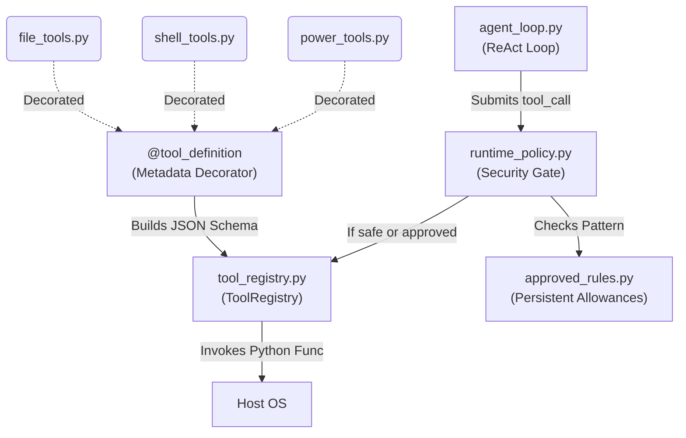

# Tools Module (`src/aradhya/tools`)

## Module Overview
The Tools module provides the physical actuators for the Aradhya agent. It is an extensive library of modular Python functions that are exposed to the LLM via JSON schema tool definitions. More importantly, this module houses the critical `runtime_policy` and `approved_rules` engines which enforce the user's "Confirmation Gate" before destructive OS actions are allowed to execute.

## System Architecture

---

## Deep Dive: Files & Mechanisms

### 1. `tool_registry.py` (The Actuator Mapping)
**Role:** Maps LLM text generations to executable Python functions.
**Mechanisms:**
- **`@tool_definition`:** A custom decorator that attaches strict metadata to standard Python functions. It requires a `name`, a `description`, an OpenAPI-style JSON schema for `parameters`, and a critical boolean flag: `requires_confirmation`.
- **`ToolRegistry` Class:** At startup, `assistant_core` imports all tool files and registers them here. The registry is responsible for translating the internal metadata into the exact format required by OpenRouter/Ollama tool APIs. When the agent loop receives a tool call, the registry maps the string name (e.g., `"run_command"`) to the actual memory address of the function, unpacks the JSON arguments, and executes it.

### 2. `runtime_policy.py` & `approved_rules.py` (The Security Gate)
**Role:** Ensures the agent cannot destroy the host machine.
**Mechanisms:**
- **The Dangerous Tools List:** Tools that can mutate the OS (like `write_file`, `delete_file`, `run_command`, `browser_click`) have `requires_confirmation=True`.
- **`runtime_policy.py`:** Intercepts every tool call before it hits the registry. If `requires_confirmation` is true, the policy engine blocks the thread and pushes an approval request to the CLI or Daemon UI. The LLM is forced to wait until the human user explicitly clicks "Allow" or types `y`.
- **`approved_rules.py`:** To prevent "alert fatigue", if the user types `a` (Always Allow) for a specific pattern (e.g., `git commit *`), the rule engine saves this persistent regex pattern to a local SQLite or JSON file. The runtime policy checks this file *before* blocking the thread. If a match is found, the confirmation gate is silently bypassed.

### 3. The Tool Libraries
**Role:** The actual implementations of the capabilities.
- **`shell_tools.py`:** Provides `run_command`. Uses safe `subprocess` wrappers. Automatically handles timeouts and large stdout truncation to prevent blowing out the LLM's context window.
- **`file_tools.py`:** Provides safe file reading, writing, moving, and deleting. Prevents arbitrary access to sensitive system paths unless elevated.
- **`browser_tools.py` & `web_tools.py`:** `web_tools` uses raw HTTP requests for fast API scraping. `browser_tools` spawns headless Playwright or Selenium instances to click buttons, type into fields, and execute Javascript for complex SPAs.
- **`vision_tools.py`:** Takes screen captures using PyAutoGUI or Pillow, compresses them, and formats them for multi-modal LLM analysis (locating buttons by coordinates).
- **`power_tools.py` & `system_tools.py`:** Exposes Windows-specific API calls to sleep, restart, or lock the machine, as well as clipboard read/write access.
- **`scheduler_tool.py`:** Allows the LLM to register delayed or recurring cron-like jobs into the Daemon's background loop.
- **`subagent_tools.py`:** A wrapper over the `agents/` module, providing the `invoke_subagent` and `send_message` tools directly to the LLM.

## Summary of Relationships
Developers create new capabilities by writing functions in a `_tools.py` file and tagging them with `@tool_definition`. **`tool_registry.py`** slurps these up and feeds their JSON schemas to the LLM. When the LLM decides to use one, the request flows through the safety checks of **`runtime_policy.py`** and **`approved_rules.py`** before the Python function actually executes and touches the host OS.
